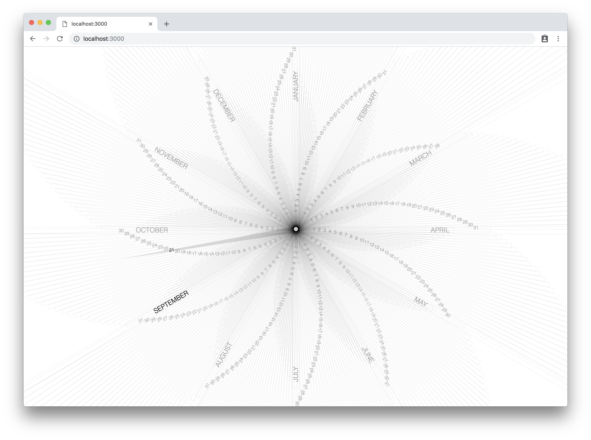

# yearclock 

You can see a live demo here: <https://devm33.github.io/yearclock/>

It is also available as [a new tab page replacement chrome extension](https://chrome.google.com/webstore/detail/year-clock/pllgmedcgbbidcoemgooimddcojgfkdl).

Click in the middle to switch to light mode

